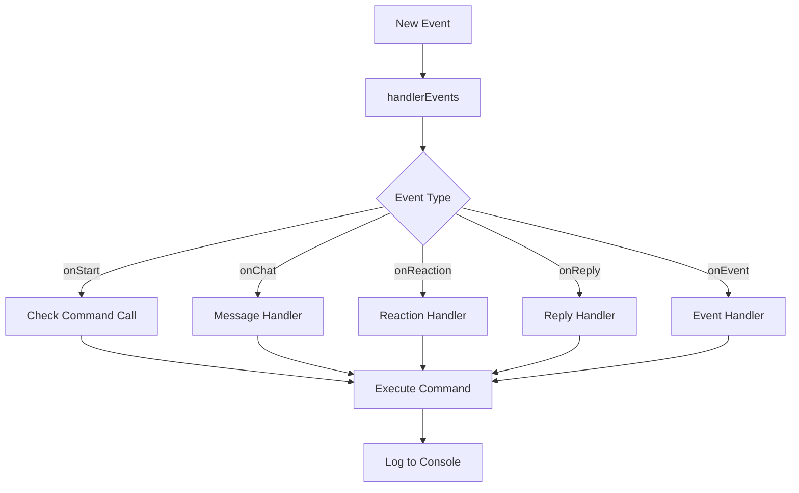

<!-- Animated Banner -->
<div align="center">
  
</div>

<!-- Animated Typing Effect -->
<div align="center">
  <a href="https://git.io/typing-svg">
    
  </a>
</div>

<br>

<!-- Animated Badges Row -->
<div align="center">
  
  [](https://nodejs.org/)
  [](https://developer.mozilla.org/en-US/docs/Web/JavaScript)
  [](https://facebook.com)
  [](LICENSE)
  
</div>

<!-- Animated Stats Row -->
<div align="center">
  
  
  
  
  
</div>

<br>

<!-- Animated Contributors Section -->
<div align="center">
  <table>
    <tr>
      <td align="center">
        <a href="https://github.com/ntkhang03">
          
        </a>
        <br>
        <sub><b>NTKhang</b></sub>
      </td>
      <td align="center">
        <a href="https://github.com/anumishra22">
          
        </a>
        <br>
        <sub><b>Anurag Mishra</b></sub>
      </td>
    </tr>
  </table>
</div>

<br>

<!-- Animated Divider -->


<br>

## 🌟 **Key Features**

<div align="center">

| ⚡ Feature | 📋 Description |
|:----------:|:--------------|
| 🔐 **No Google Auth** | Zero Google API credentials needed - Simple Facebook login |
| ⚡ **Fast Performance** | Built on optimized unofficial Facebook API |
| 🎭 **5-Tier Roles** | User → Group Admin → Bot Admin → Premium → Developer |
| 💰 **Premium System** | Money-based premium features for advanced commands |
| 🛡️ **Dev Tools** | Built-in shell & eval commands for developers |
| 🎯 **Smart Commands** | Auto-suggestion for typos with helpful hints |
| ☁️ **Deploy Anywhere** | Ready for Render, Railway, Replit, VPS & more |
| 😡 **React Delete** | Admins can react with 😡 to unsend bot messages |

</div>

<br>

<!-- Animated Tech Stack -->
## 🛠️ **Tech Stack**

<div align="center">
  
  
  
  
  
  
  
</div>

<br>

<!-- Animated Divider -->


<br>

## 📑 **Table of Contents**

- [📝 Important Notes](#-important-notes)
- [🚧 Requirements](#-requirements)
- [🚀 Installation](#-installation)
- [☁️ Deployment](#️-deployment)
- [💡 How It Works](#-how-it-works)
- [🛠️ Creating Commands](#️-creating-commands)
- [💭 Support](#-support)
- [📸 Screenshots](#-screenshots)
- [📜 License](#-license)

<br>

<!-- Animated Divider -->


<br>

## 📝 **Important Notes**

> [!WARNING]
> **Account Safety First!**
> 
> - This bot uses `fca-anurag-miishraa` (Facebook Chat API)
> - **No Google API credentials needed** - Simple setup with just Facebook account
> - Using unofficial APIs may risk account restrictions
> - **Recommended:** Use a secondary/clone Facebook account
> - Developers are not responsible for any account issues

### ✨ **What's New in Enhanced Version**

```diff
+ 🎖️ Advanced Role System: 5 permission levels (0-4)
+ 💎 Premium Users (Role 3): Money-based premium features
+ 👨‍💻 Developers (Role 4): Full system access with shell & eval
+ 🤖 Smart Command Suggestions: Typo detection with closest match
+ 😡 React to Delete: Admins can react with 😡 to unsend messages
+ ☁️ Deploy Ready: Pre-configured for Render, Railway & more
+ 🎨 Clean Icons: Replaced emoji clutter with elegant Unicode icons
```

<br>

<!-- Animated Divider -->


<br>

## 🚧 **Requirements**

<div align="center">

| Requirement | Details |
|:-----------:|:--------|
|  | [Download Node.js](https://nodejs.org/) |
|  | Basic JS knowledge (optional but helpful) |
|  | Secondary account (recommended) |
|  | **No Google credentials required!** |

</div>

<br>

<!-- Animated Divider -->


<br>

## 🚀 **Installation**

### 💻 **Local Setup**

```bash
# Clone the repository
git clone https://github.com/anumishra22/ANURAG-MASTI-BOT.git

# Navigate to directory
cd ANURAG-MASTI-BOT

# Install dependencies
npm install

# Configure your settings in config.json
# Then start the bot
npm start
```

### ⚡ **Quick Start with One Command**

```bash
git clone https://github.com/anumishra22/ANURAG-MASTI-BOT.git && cd ANURAG-MASTI-BOT && npm install && npm start
```

<br>

<!-- Animated Divider -->


<br>

## ☁️ **Deployment**

<div align="center">

[](DEPLOY.md#render)
[](DEPLOY.md#railway)
[](DEPLOY.md#replit)
[](DEPLOY.md#vpsserver)

</div>

📘 **Detailed deployment guide**: See [DEPLOY.md](DEPLOY.md)

<br>

<!-- Animated Divider -->


<br>

## 💡 **How It Works**

The bot uses the unofficial Facebook API to send and receive messages. Here's the event handling flow:



### 📋 **Handler Types**

| Handler | Description |
|:-------:|:------------|
| `onStart` | Triggered when user calls a command |
| `onChat` | Runs when user sends any message |
| `onFirstChat` | Runs on first message from chat box |
| `onReaction` | Handles message reactions |
| `onReply` | Handles message replies |
| `onEvent` | Handles group events (join/leave/etc) |

<br>

<!-- Animated Divider -->


<br>

## 🛠️ **Creating Commands**

📚 **Full Documentation**: See [DOCS.md](DOCS.md) for detailed command creation guide.

### 📝 **Basic Command Structure**

```javascript
module.exports = {
  config: {
    name: "hello",
    version: "1.0",
    author: "Your Name",
    countDown: 5,
    role: 0, // 0=User, 1=Group Admin, 2=Bot Admin, 3=Premium, 4=Developer
    description: "Say hello",
    category: "fun"
  },
  
  onStart: async function({ message, args, event, api }) {
    message.reply("Hello! 👋");
  }
};
```

<br>

<!-- Animated Divider -->


<br>

## 💭 **Support**

<div align="center">

Need help? Join our community!

[](https://discord.com/invite/DbyGwmkpVY)
[](https://www.facebook.com/groups/goatbot)
[](https://m.me/j/Abbq0B-nmkGJUl2C)

</div>

> [!NOTE]
> Please do not send private messages. Join the chat groups for support. Thank you!

<br>

<!-- Animated Divider -->


<br>

## 📸 **Screenshots**

<details>
<summary>🎖️ <b>Rank System</b></summary>
<br>
<div align="center">
  
  <p><em>Rank Card</em></p>
  
  <p><em>Rankup Notification</em></p>
</div>
</details>

<details>
<summary>🌤️ <b>Weather Command</b></summary>
<br>
<div align="center">
  
</div>
</details>

<details>
<summary>👋 <b>Welcome/Leave Messages</b></summary>
<br>
<div align="center">
  
</div>
</details>

<details>
<summary>🤖 <b>AI Features</b></summary>
<br>
<div align="center">
  
  <p><em>GPT Integration</em></p>
  
  <p><em>OpenJourney AI</em></p>
</div>
</details>

<details>
<summary>📊 <b>Dashboard</b></summary>
<br>
<div align="center">
  
  <p><em>Dashboard Home</em></p>
  
  <p><em>Statistics</em></p>
  
  <p><em>Login/Register</em></p>
</div>
</details>

<br>

<!-- Animated Divider -->


<br>

## 📚 **Supported Languages**

<div align="center">

| Language | Status |
|:--------:|:------:|
| 🇺🇸 English | ✅ Supported |
| 🇻🇳 Vietnamese | ✅ Supported |

</div>

Change language in `config.json` file. You can customize languages in the `languages/` folder.

<br>

<!-- Animated Divider -->


<br>

## 📌 **Common Problems**

<details>
<summary>❌ <b>Error 400: redirect_uri_mismatch</b></summary>

1. Enable Google Drive API: [Tutorial](https://youtu.be/nTIT8OQeRnY?t=347)
2. Add URI `https://developers.google.com/oauthplayground` to **Authorized redirect URIs**
3. Choose required scopes in OAuth 2.0 Playground
</details>

<details>
<summary>❌ <b>Error: Invalid domain for site key</b></summary>

1. Go to [reCAPTCHA Admin](https://www.google.com/recaptcha/admin)
2. Add domain `repl.co` to Domains in reCAPTCHA v2
</details>

<details>
<summary>❌ <b>GaxiosError: invalid_grant</b></summary>

- If project not published in Google Console, refresh token expires after 1 week
- You need to regenerate the token
</details>

<br>

<!-- Animated Divider -->


<br>

## ⚠️ **Security Warning**

> [!CAUTION]
> **DO NOT USE UNKNOWN SOURCE CODE**
> 
> - Unknown source code can infect your device with viruses, malware, or hack your accounts
> - **ANURAG-MASTI-BOT** is only published at: `https://github.com/anumishra22/ANURAG-MASTI-BOT`
> - All other sources, forks from other GitHub accounts, Replit, etc. are fake and violate policy
> - Using from other sources means you are in violation and will be banned without notice

<br>

<!-- Animated Divider -->


<br>

## ✨ **Credits**

<div align="center">

### 👑 Original Creator
**[NTKhang (NTKhang03)](https://github.com/ntkhang03)**

### ✨ Enhanced & Modified by
**[Anurag Mishra (anumishra22)](https://github.com/anumishra22)**

</div>

<br>

<!-- Animated Divider -->


<br>

## 📜 **License**

<div align="center">

[](LICENSE)

</div>

### **VIETNAMESE**

> - ***Nếu bạn vi phạm bất kỳ quy tắc nào, bạn sẽ bị cấm sử dụng dự án của tôi***
> - Không bán mã nguồn của tôi
> - Không tự xưng là chủ sở hữu của mã nguồn của tôi
> - Không kiếm tiền từ mã nguồn của tôi (chẳng hạn như: mua bán lệnh, mua bán/cho thuê bot, kêu gọi quyên góp, v.v.)
> - Không xóa/sửa đổi credit (tên tác giả) trong mã nguồn của tôi

### **ENGLISH**

> - ***If you violate any rules, you will be banned from using my project***
> - Don't sell my source code
> - Don't claim my source code as your own
> - Do not monetize my source code (such as: buy and sell commands, buy and sell bots, call for donations, etc.)
> - Don't remove/edit my credits (author name) in my source code

<br>

<!-- Animated Footer -->
<div align="center">
  
</div>

<!-- Animated Visitor Counter -->
<div align="center">
  
  
  
</div>

<!-- Profile Views -->
<div align="center">
  
  [](https://github.com/anumishra22)
  [](https://github.com/anumishra22/ANURAG-MASTI-BOT)
  
</div>

<!-- Animated Thank You -->
<div align="center">
  <a href="https://git.io/typing-svg">
    
  </a>
</div>
